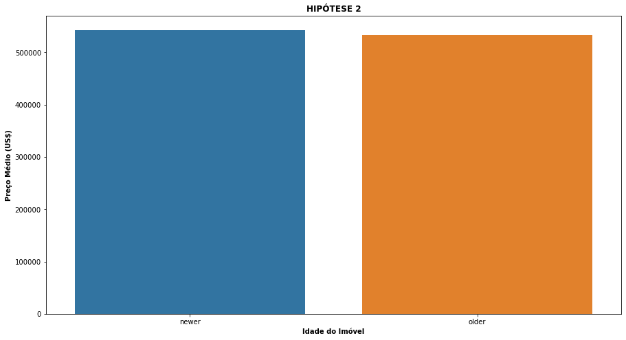

# Projeto House Rocket - Insights

O dataset utilizado foi o "House Sales in King County, USA" extraídos do [Kaggle](https://www.kaggle.com/harlfoxem/housesalesprediction).

Acesse o código deste projeto [aqui](https://github.com/moraes-ederson/Proj_HouseRocket_Insights/blob/944ca6238ed47270dd1158be6c6ca00e325b73b6/Proj_HouseRocket_Insights_v01.ipynb).

## 1. Problema de Negócio

Trata-se de um problema fictício que visa encontrar as melhores oportunidades de compra e venda de imóveis disponíveis no portfólio da House Rocket, empresa também fictícia.  
E quais são as dores enfrentadas pelos tomadores de decisão?  
•	O time do negócio não consegue tomar boas decisões de compra sem analisar os dados.  
•	O portfólio é muito grande e leva muito tempo para fazer o trabalho manualmente.  

### 1.1 Objetivo

Gerar insights através da análise e manipulação dos dados para auxiliar na tomada de decisão pelo time de negócios.  

### 1.2 Questões de negócios a serem respondidas

1 - Quais são os imóveis que a House Rocket deveria comprar e por qual preço?  
2 - Uma vez o imóvel comprado, qual o melhor momento para vendê-lo e por qual preço?  

### 1.3 Insights

Visando descobrir e entregar mais insights para o time de negócios, vamos explorar e validar as seguintes hipóteses:  
•	H1: Imóveis que possuem vista para água são pelo menos 30% mais caros, na média.  
•	H2: Imóveis com ano de construção menor que 1955 são pelo menos 50% mais baratos, na média.  
•	H3: Imóveis sem porão possuem terrenos pelo menos 50% maiores do que com porão, na média.  
•	H4: O crescimento do preço dos imóveis YoY (Year over Year) é de pelo menos 10%.  
•	H5: Imóveis com 3 banheiros tem um crescimento de preço MoM (Month over Month) de pelo menos 15%.  

## 2. Dicionário de Variáveis

### 2.1 Variáveis Originais

| Variável | Definição |
| :--- | :--- |
|id | ID único para cada imóvel a venda. |
|date | Data da venda da casa. |
|price | Preço de cada casa a venda. |
|bedrooms | Número de quartos. |
|bathrooms | Número de banheiros, onde 0,5 corresponde a um quarto com banheiro, mas sem chuveiro, e 0,75 ou ¾ é um banheiro que contém uma pia, um vaso sanitário e um chuveiro ou banheira. |
|sqft_living | Área (em pés quadrados) do espaço interior dos apartamentos. |
|sqft_lot | Área (em pés quadrados) do terreno. |
|floors | Número de pisos/andares. |
|waterfront | Variável fictícia para saber se o apartamento tinha vista para o mar ou não. |
|view | Índice de 0 a 4 de quão boa era a vista da propriedade. |
|condition | Índice de 1 a 5 sobre o estado (a condição) do imóvel. |
|grade | Índice de 1 a 13, onde 1-3 fica aquém da construção e design do edifício, 7 tem um nível médio de construção e design e 11-13 tem um nível de construção e design de alta qualidade. |
|sqft_above | Área (em pés quadrados) do espaço habitacional interior acima do nível do solo. |
|sqft_basement | Área (em pés quadrados) do espaço habitacional interno que está abaixo do nível do solo. |
|yr_built | Ano em que o imóvel foi inicialmente construído. |
|yr_renovated | Ano da última reforma do imóvel. |
|zipcode | Área do código postal em que o imóvel está. |
|lat | Latitude. |
|long | Longitude. |
|sqft_living15 | Área (em pés quadrados) do espaço interno de habitação para os 15 vizinhos mais próximos. |
|sqft_lot15 | Área (em pés quadrados) dos lotes de terreno dos 15 vizinhos mais próximos. |

### 2.2 Variáveis Criadas Durante o Projeto

| Variável | Definição |
| :--- | :--- |
| median_price_zip | Mediana do preço agrupado por região (zipcode). |
| recommendation | Recomendação de compra do imóvel. |
| saving | Economia sugerida ao efetuar a compra do imóvel recomendado. |
| month | Mês de anúncio, extraído da variável "date". |
| season | Estações do ano. |
| median_price_season | Mediana de preço agrupado por região (zipcode) e estão do ano. |
| sell_price | Recomendação de preço de venda do imóvel. |
| profit | Lucro sugerido ao efetuar a venda do imóvel recomendado. |
| mean_price | Preço médio. |
| age_built | Classificação do imóvel como antigo, para ano de construção menor ou igual a 1955, ou novo. |
| basement | Se imóvel possui ou não porão. |
| mean_sqft_lot | Média da área do terreno. |
| year | Ano de anúncio, extraído da variável "date". |
| growth_YoY | Crescimento de preço ano a ano (YoY). |
| year_month | Ano e mês de anúncio, extraído da variável "date". |
| growth_MoM | Crescimento de preço mês a mês (MoM). |

## 3. Premissas

•	Preços indicados em dólares americanos (US$).  
•	Dimensões de áreas indicadas em pés quadrados.  
•	Foram mantidos todos registros do conjunto de dados.  
•	Há “IDs” repetidos, porém com informações e atributos diferentes.  
•	Mantidos também os outliers para validação das hipóteses.  
•	Compra viável considerada apenas para imóveis avaliados com índice de condição sobre o estado do mesmo sendo maior ou igual a 3.  

## 4. Planejamento da Solução  

Para recomendação de compra:

•	Agrupar os imóveis por região (zipcode).  
•	Dentro de cada região, encontrar a mediana do preço do imóvel.  
•	Sugerir que os imóveis abaixo do preço mediano da região e que estejam em boas condições sejam comprados.  

Para recomendação de venda:

•	Agrupar os imóveis recomendados para compra por região (zipcode) e por sazonalidade (estações do ano).  
•	Dentro de cada região e sazonalidade, calcular a mediana do preço.  
•	Condições de venda:  
1 -	Se o preço da compra for maior que a mediana da região + sazonalidade: O preço da venda será igual ao preço da compra + 10%.  
2 -	Se o preço da compra for menor que a mediana da região + sazonalidade. O preço da venda será igual ao preço da compra + 30%.  

## 5. Principais Insights desta Análise

•	Imóveis com vista para água são na média 213% mais caros do que os demais.  

•	O ano de construção do imóvel não impacta no seu preço.  

•	O aumento de preço dos imóveis “YoY” (ano após ano) é de pouco mais de 0,5% apenas.  

•	Pouco mais da metade do portfólio não são boas recomendações de compra.  

| Recomendação | Qtde. de Imóveis |
| :--- | :--- |
| não comprar | 11034 |
| comprar | 10579 |

•	Os imóveis anunciados na primavera são mais caros, enquanto os anunciados no inverno são os mais baratos, em média. Logo é mais recomendado anunciar a venda na primavera e comprar quando estiver no inverno.  

| Estação | Preço Médio Imóvel |
| :--- | :--- |
| Primavera | $397.242 |
| Verão | $390.080 |
| Outono | $379.273 |
| Inverno | $375.623 |

## 6. Resultados Financeiros para o Negócio

A empresa tem potencial para economizar cerca de $1.055.901.488 (25.79%) adquirindo os imóveis recomendados considerando valor mediano de mercado.  

A empresa tem potencial para lucrar cerca de $774.596.311 (529%) considerando a venda dos imóveis adquiridos nos valores recomendados.  

## 7. Conclusão

O objetivo inicial foi alcançado, onde conseguimos gerar os relatórios com as recomendações de preço de compra e venda, bem como o melhor momento para realizar a venda.  

## 8. Próximos Passos Possíveis para Melhorias do Projeto

•	Gerar um app de visualização com Streamlit ou outra ferramenta de “DataViz”.  
•	Detalhar e tratar outliers.  
•	Analisar mais variáveis e validar mais hipóteses buscando novos insights.  
•	Checar quais atributos mais impactam no preço dos imóveis.  
•	Coletar informações da localização dos imóveis através de uma API geográfica e adicioná-las ao conjunto de dados ou relatório de entrega.  
•	Adicionar um mapa interativo com os imóveis disponíveis no portfólio.  
•	Construir um modelo de machine learning para predizer os preços dos imóveis de determinada região.

## Autor

Ederson de Moraes

